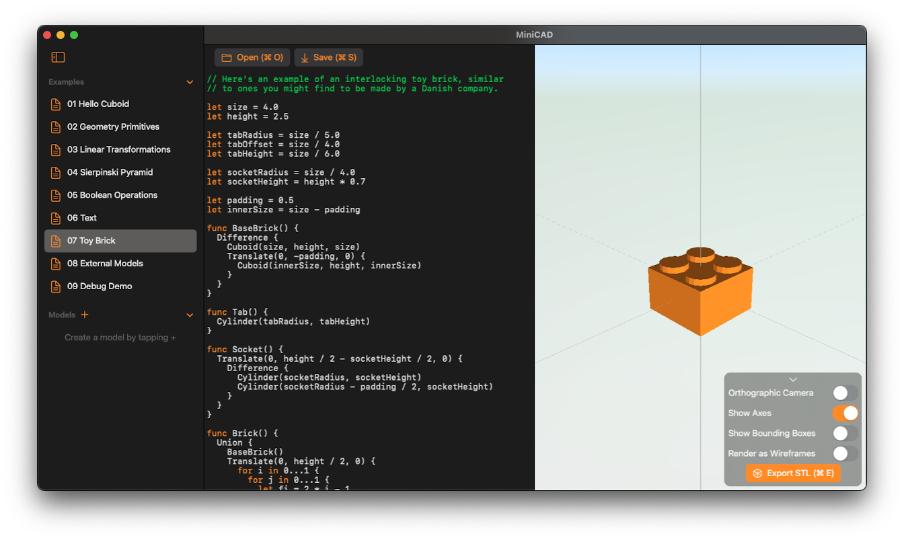

# MiniCAD

A parameteric 3D modeller for macOS and iOS featuring a Swift-inspired Domain Specific Language (DSL) for modeling.

<!-- TODO: Implement mesh operations -->

## Open Source

<!-- TODO: Mention suzanne https://de.m.wikipedia.org/wiki/Datei:Suzanne.png and csg.js -->

## See also

* [MiniBlocks](https://github.com/fwcd/mini-blocks), an open-world sandbox game built with SceneKit (my 2022 project)
* [MiniCut](https://github.com/fwcd/mini-cut), a tiny video editor built with SpriteKit (my 2021 project)
* [MiniJam](https://github.com/fwcd/mini-jam), a tiny digital audio workstation built with SwiftUI (my 2020 project)
